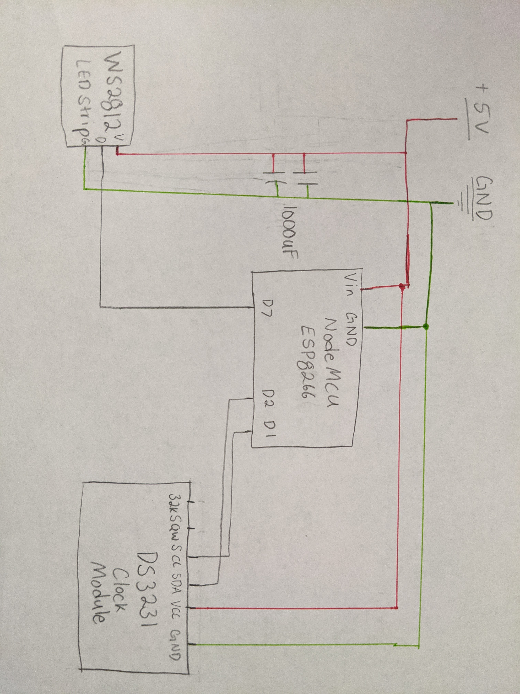

# Sunrise Alarm Clock

A sunrise alarm clock, or dawn simulation light, is an artificial light source that is integrated into a standard digital clock. It is timed to gradually wake a person at a selected time. It does this by mimicking the steadily increasing light of sunrise.

# Parts

- NodeMCU ESP8226 microcontroller
- DS3231 Realtime clock module
- 1000 uF capacitor
- 30 ws2812b addressable leds
- wires
- bread board
- 5v ~2 amp power supply

# Key Points

- The NodeMCU is used as the microcontroller for this project. It runs a webserver that will allow you to set your alarm time among other things.

- Storing the alarm time in EEPROM allows for the time to be persisted even if power is lost or the server is restarted.

- The DS321 is an extremly precise way to keep time and is able to stay consitent even when power is lost.

- 30 addressable LEDs and the Neopixel library are used for the sunrise simulation. At full brightness white, each LED needs around 50mA. 30 will therefore use around 1.5 Amps. The 2 amp PSU is plenty powerful, plus this project does not use full bright white. Do not try to power all 30 LEDs through the board. It will draw too much current and fry your board and possibly computer.

- Over the air updates are used to program the board to avoid needing to unplug the LEDs and external PSU each time it needs to be programmed.

- A 1000 uf capacitor is used between the PSU and LEDs as a bypass capacitor

# Schematic

# To Do

- Create front end using a framework an host on netlify, instead of building HTML in C++
